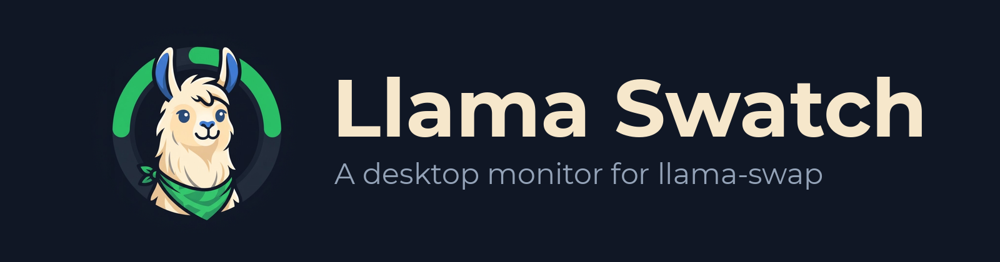
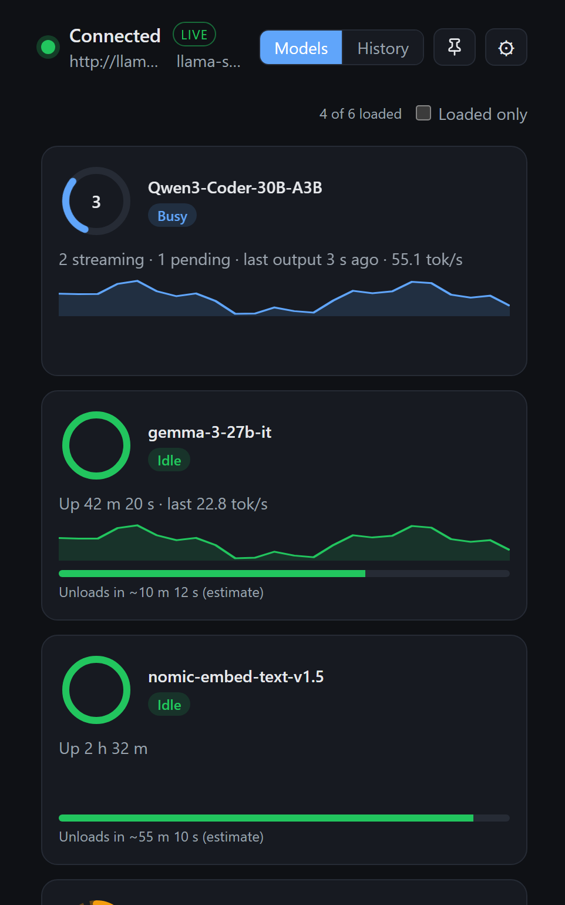
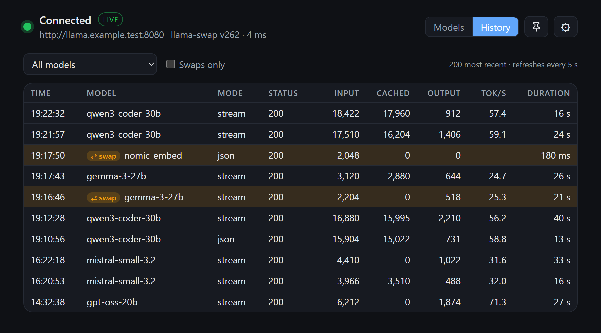

<h1 align="center">
  
</h1>

A desktop monitor for [llama-swap](https://github.com/mostlygeek/llama-swap).
It shows what your llama-swap instance is doing: whether it's reachable, which models
are loaded, which are busy or stuck, and a summary of throughput.

Works with llama-swap running anywhere you can reach over HTTP: the same machine, a box
on your LAN, or behind a reverse proxy.

Tested with llama-swap v249 to v262. The header shows an amber note when the server reports a
release outside that range.

Llama Swatch is an independent project. It is not affiliated with or endorsed by llama-swap
or its maintainers.

<p align="center">
  
  
</p>
<p align="center"><sub>Screenshots use made-up data.</sub></p>

## What the states mean

| State | Looks like | Meaning |
|---|---|---|
| Not loaded | dimmed grey ring | Configured in llama-swap, not running |
| Loading | amber pulsing ring, seconds in the middle | llama-swap is starting the model. Past the slow-load warning (default 120 s) the card adds a `slow load` hint; llama-swap's own health-check timeout decides whether the load fails |
| Idle | solid green ring, TTL bar | Loaded, no requests in flight |
| Loaded | solid grey ring, `no live data` | Ready, but the monitor isn't reading live events, so it can't tell busy from idle |
| Busy | spinning blue arc, request count | At least one request is in flight and remains within its applicable timeout |
| Stalled | red ring with `!` | Unloading took too long, or the model stopped producing output |
| Unloading | fading grey ring | llama-swap is stopping the model |

A busy card counts requests in three groups, plus how long ago output last arrived, e.g.
`3 streaming · 1 started · 2 pending · last output 4 s ago` (hover the card for the full wording):

- **streaming**: output is arriving.
- **started**: the reply has started (llama-swap has seen its headers) but no output has
  arrived yet. With llama.cpp this is usually brief; it shows up e.g. with other backends.
- **pending**: nothing has come back yet. A non-streaming chat (`"stream": false`) or an
  embeddings request looks like this until it finishes, because its whole reply arrives at once.
  With llama.cpp backends a streaming request also looks like this while it processes its
  prompt, since llama.cpp's server sends the reply headers only with its first result.

Stalls are judged for the whole model, not per request: while any request is streaming, the
model is Stalled only when every streaming request has been quiet longer than the stream stall
timeout, so a request waiting its turn never marks an active model as Stalled. With nothing
streaming yet, it is Stalled once a started request has waited longer than the no-first-byte
timeout without output. A pending request never makes the model Stalled, since the monitor
cannot tell a long non-streaming generation or prompt from a stuck one; past the no-first-byte
timeout the card adds a `reply slow` hint instead. So that setting drives the Stalled rule only
for replies that have started, and otherwise drives the `reply slow` hint. A started request
that waits for its first token more than 10 times that timeout while others stream adds a
`waiting long` hint.

Busy and output-stall detection need llama-swap's live event stream (`/api/events`).
The header badge shows its state:

- `live`: events are arriving and being read.
- `waiting for events`: the stream is open but no request event has been read from it yet
  (llama-swap may send nothing while idle). Ready models still show Idle unless an event fails
  to decode.
- `events unreadable` (amber): three request events in a row could not be decoded, so this
  llama-swap sends events in a shape this version of the monitor can't read.
- `polling`: no event stream.

Without readable events a ready model shows as Loaded rather than Idle. After events recover,
a request that was already running may show as Idle until it sends output or finishes.

## Window

- On first launch the window opens centred at 481 x 770; on a screen whose work area is too
  short, the height shrinks to fit. It is always resizable, and your size, position and
  maximized state are remembered between launches. If the saved position is on a monitor that
  is no longer connected, the saved size is kept and the window opens at the default position
  on the main screen instead. After startup the app never resizes or moves the window by itself.
- Cards are one per row at a fixed height, and the header, toolbar, tiles and History columns
  keep their size as data changes, so nothing jumps around. Status banners and error toasts
  overlay the bottom of the window rather than pushing content down.
- The pin button in the header (left of the gear) keeps the window above other windows. The
  choice is saved in the settings file and re-applied at startup. Always-on-top is a window
  manager feature: on Linux it works on X11, but some Wayland compositors ignore it, in which
  case the button simply has no effect.
- When a newer release is out, a blue badge such as `v0.2.0 available` appears next to the
  connection status; click it to open the release page in your browser. The app never
  downloads or installs anything itself.
- **Theme** in settings (the gear) is Match system, Light or Dark. Match system follows the OS
  light/dark setting and switches live when it changes. On Linux it reads the desktop's
  dark-style switch through the XDG desktop portal (GNOME, KDE Plasma and most other desktops with
  a portal), falling back to the GTK theme name; if neither says, the app shows light. Pick Dark
  or Light to override it.

## Install

Releases are published on the [Releases](../../releases) page, and only when every platform
build succeeds. Pick the file for your OS:

| OS | File |
|---|---|
| Windows | `*-setup.exe` (installer) or `*.msi` |
| macOS | `*.dmg` (universal: Apple silicon and Intel). Ignore `*.app.tar.gz` and any `.sig` files |
| Linux | `*.deb`, `*.rpm`, or `*.AppImage` |

Each release also has a `SHA256SUMS.txt`. To verify a download, put it in the same folder
as the file and compare:

```powershell
# Windows (PowerShell): compare the output with the matching line in SHA256SUMS.txt
(Get-FileHash ".\<file>" -Algorithm SHA256).Hash.ToLower()
```

```bash
# Linux
sha256sum -c SHA256SUMS.txt --ignore-missing
# macOS
grep "<file>" SHA256SUMS.txt | shasum -a 256 -c
```

These builds are **not code-signed or notarized**, so each OS warns on first launch:

- **Windows:** SmartScreen says "Windows protected your PC". Click **More info → Run anyway**.
- **macOS:** right-click the app → **Open** → **Open**. If macOS says the app is damaged, run
  `xattr -dr com.apple.quarantine "/Applications/Llama Swatch.app"`.
- **Linux:** use the `.deb` or `.rpm`, or `chmod +x` the `.AppImage` and run it. The API key is
  stored through the Secret Service (GNOME Keyring or KWallet), so one of those must be running.

Prefer not to trust a binary? Build it yourself, see [Develop](#develop).

## Connect

The API key is optional: you only need one if your llama-swap config sets `apiKeys:`.

1. Enter llama-swap's URL, e.g. `http://llama-swap.example:8080`. Paste the OpenAI-style `.../v1`
   URL if that's what you have; the `/v1` is removed.
2. If your llama-swap config has `apiKeys:`, paste one of those keys. It is stored in your OS
   keychain (Windows Credential Manager, macOS Keychain, Linux Secret Service), never in a
   file, and the UI never sees it again.
3. **Save** tests the connection first and only saves if it works.

   The saved key is only ever sent to the URL it was saved for. If you change the URL, paste
   the key again.

**Check GitHub for a new release at startup** is ticked by default in settings. Once per
launch, once a connection has been saved and unless you've unticked it, the app makes one request to
`api.github.com` for this repository's latest release tag. GitHub sees your IP address and
the app version (in the User-Agent); nothing about your llama-swap is sent. Untick it to turn
the check off. If you upgraded from a version without this setting, the check is on and the
window says so once, with buttons to keep it on or turn it off.

Thresholds (slow-load warning, no-first-byte timeout, and so on) are under
**Stall detection** in settings. The no-first-byte timeout marks a model Stalled only when a
reply has started but sent nothing; a request with no reply yet just gets the `reply slow`
hint.

## Develop

Requires Node 22+, Rust stable, and the [Tauri prerequisites](https://tauri.app/start/prerequisites/)
for your OS.

```bash
npm install
npm run tauri dev
```

```bash
cargo test --manifest-path src-tauri/Cargo.toml
```

Releases: push a `v*` tag. GitHub Actions builds Windows, macOS (universal) and Linux
installers, publishes them as a release once all builds succeed (a tag containing a hyphen, like `v1.0.0-rc1`, is
marked pre-release), and attaches `SHA256SUMS.txt`.

To build installers locally, run `npm run tauri build`.

## License

Licensed under the Apache License, Version 2.0. See LICENSE and NOTICE.

Third-party dependencies are under their own licenses (MIT, Apache-2.0, BSD, ISC, Zlib, MPL-2.0 and similar).
